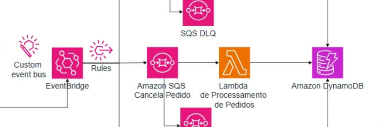

# ⚙️ Arquitetura Orientada a Eventos - Processamento Central e Persistência (AWS)

Projeto desenvolvido na **Semana do Desenvolvedor AWS (Escola da Nuvem)** – **Dia 3: Processamento Central de Pedidos e Persistência**.  

---

## 🎯 Objetivo
Consumir os eventos de pedidos validados (API + S3) e realizar o **processamento central**:  
1. Capturar eventos `NovoPedidoValidado` no **EventBridge**.  
2. Enviar para uma fila **SQS Standard** de pedidos pendentes.  
3. Acionar uma **Lambda** que processa os pedidos (simulação: estoque, frete, etc.).  
4. Persistir os dados e status finais em uma **tabela DynamoDB**.  

---

## 🗺️ Arquitetura (visão geral do fluxo)


## 🛠️ Recursos Criados

---

- **IAM Role**: `lambda-processa-pedidos-role-seu-nome`  
- **Amazon SQS (Standard + DLQ)**:  
  - `pedidos-pendentes-queue-seu-nome`  
  - `pedidos-pendentes-dlq-seu-nome`  
- **AWS Lambda**: `processa-pedidos-lambda-seu-nome`  
- **Amazon DynamoDB**: `pedidos-db-seu-nome`  
- **Amazon EventBridge Rule**: `novo-pedido-validado-rule-seu-nome`  

---

## 🗂️ Passo a Passo

### 1) IAM Role
- Criada a **role `lambda-processa-pedidos-role`** com permissões para:  
  - **Receber/Deletar** mensagens da SQS de pedidos pendentes.  
  - **PutItem/UpdateItem/GetItem** na tabela DynamoDB de pedidos.  

---

### 2) SQS (Pedidos Pendentes)
- Criada **DLQ**: `pedidos-pendentes-dlq`.  
- Criada **fila principal**: `pedidos-pendentes-queue`.  
  - **Visibility timeout** = 70s.  
  - **DLQ** configurada com 3 tentativas.  

---

### 3) DynamoDB
- Criada tabela: `pedidos-db-seu-nome`.  
- **Partition key**: `pedidoId (String)`.  
- Armazena os pedidos processados com seus **detalhes e status**.  

---

### 4) Lambda de Processamento de Pedidos
- Função: `processa-pedidos-lambda-seu-nome` (Python 3.12).  
- **Variável de ambiente**:  
  - `DYNAMODB_TABLE_NAME = pedidos-db-seu-nome`  
- Timeout: **60 segundos**.  
- **Trigger**: `pedidos-pendentes-queue` (Batch size = 1).  
- **Responsável por**:  
  - Ler mensagens da fila SQS.  
  - Executar lógica de negócio simulada (ex.: estoque, frete).  
  - Persistir no DynamoDB com status `PEDIDO_PROCESSADO`.  

---

### 5) EventBridge Rule
- Regra criada no **Custom Event Bus (Aula 1)**.  
- Nome: `novo-pedido-validado-rule-seu-nome`.  
- **Padrão do evento (event pattern)**:  
```json
{
  "source": ["lab.aula1.pedidos.validacao"],
  "detail-type": ["NovoPedidoValidado"]
}
```

# Target: fila pedidos-pendentes-queue.

## 🔬 Testes Realizados

### Teste 1 — Pedido via API (Aula 1)

```json
{
  "pedidoId": "apiP001-seu-nome",
  "clienteId": "clienteAPI-XYZ-seu-nome",
  "itens": [
    {"item": "Produto X API", "qtd": 1}
  ]
}
```
Evento publicado no EventBridge → roteado para SQS → consumido pela Lambda → persistido no DynamoDB.

## Teste 2 — Pedido via Arquivo S3 (Aula 2)

Upload de `outro_arquivo_pedidos.json` no bucket S3.

Pedido (`s3P003-seu-nome`) validado → evento publicado no EventBridge → roteado para SQS → processado pela Lambda → persistido no DynamoDB.

---

## Verificações

- Logs da Lambda (validação + processamento) → mostram fluxo API + S3 funcionando.
- EventBridge Monitoring → métricas de eventos capturados.
- SQS de pedidos pendentes → mensagens consumidas rapidamente.
- DynamoDB → registros criados:
  - `apiP001-seu-nome` com status **PEDIDO_PROCESSADO**.
  - `s3P003-seu-nome` com status **PEDIDO_PROCESSADO**.

---

## ✅ Resultado

- Eventos de pedidos validados agora acionam o processamento central.
- SQS atua como buffer entre EventBridge e Lambda.
- Lambda processa e persiste no DynamoDB.
- Pipeline integrado: API + S3 → EventBridge → SQS → Lambda → DynamoDB.

---

## 🔜 Próximos Passos (Dia 4)

Expandir funcionalidades para:

- Cancelamento e alteração de pedidos.
- Reforço do tratamento de erros com DLQs em todos os pontos.
- Uso de Lambda Layers para reuso de código.
