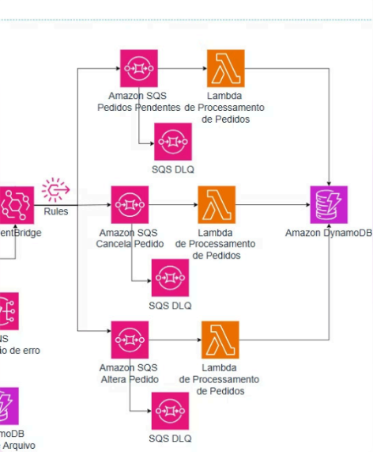

# ⚙️ Arquitetura Orientada a Eventos - Fluxos Adicionais e DLQs (AWS)

Projeto desenvolvido na **Semana do Desenvolvedor AWS (Escola da Nuvem)** – **Dia 4: Fluxos Adicionais de Pedidos, DLQs e Lambda Layers**.  

---

## 🎯 Objetivo
Expandir a arquitetura criada anteriormente para incluir novas operações no ciclo de vida dos pedidos:  
- **Cancelamento de pedidos**  
- **Alteração de pedidos**  
- Reforçar o uso de **DLQs (Dead Letter Queues)** para tratamento de erros.  

Ao final:  
- Fluxos completos de **cancelamento e alteração**.  
- **Novas regras do EventBridge**, filas SQS e funções Lambda dedicadas.  
- **Testes práticos com DLQs** para observar mensagens que falham.  

---

## 🗺️ Arquitetura (visão geral do fluxo)



---

## 🛠️ Recursos Criados

- **IAM Role**: `lambda-altera-cancela-role-seu-nome`  
- **Amazon SQS (Standard + DLQ)**:  
  - `cancela-pedido-queue-seu-nome` / `cancela-pedido-dlq-seu-nome`  
  - `altera-pedido-queue-seu-nome` / `altera-pedido-dlq-seu-nome`  
- **AWS Lambda**:  
  - `cancela-pedido-lambda-seu-nome`  
  - `altera-pedido-lambda-seu-nome`  
- **Amazon EventBridge Rules**:  
  - `cancela-pedido-rule-seu-nome`  
  - `altera-pedido-rule-seu-nome`  
- Revisão e testes de DLQs existentes.  

---

## 🗂️ Passo a Passo

### 1) IAM Role
- Criada role `lambda-altera-cancela-role` com permissões para:  
  - **Consumir mensagens** das filas de alteração/cancelamento.  
  - **Atualizar pedidos no DynamoDB** (`UpdateItem`, `GetItem`).  

---

### 2) Fluxo de Cancelamento
- Criadas filas:  
  - `cancela-pedido-dlq` (DLQ)  
  - `cancela-pedido-queue` (principal, timeout 70s, maxReceive=3).  
- Criada Lambda: `cancela-pedido-lambda` (Python 3.12).  
  - Variável de ambiente: `DYNAMODB_TABLE_NAME = pedidos-db-seu-nome`.  
  - Trigger: fila `cancela-pedido-queue`.  
  - Atualiza status para **CANCELADO** no DynamoDB.  
- Regra no EventBridge:  
```json
{
  "source": ["lab.aula4.operacoes"],
  "detail-type": ["CancelarPedido"]
}
```
# 3) Fluxo de Alteração

Criadas filas:

- `altera-pedido-dlq` (DLQ)
- `altera-pedido-queue` (principal, timeout 70s, maxReceive=3)

Criada Lambda: `altera-pedido-lambda` (Python 3.12).

Variável de ambiente:  
`DYNAMODB_TABLE_NAME = pedidos-db-seu-nome`

Trigger: fila `altera-pedido-queue`.

Atualiza status para **ALTERADO** e itens no DynamoDB.

Regra no EventBridge:

```json
{
  "source": ["lab.aula4.operacoes"],
  "detail-type": ["AlterarPedido"]
}
```
# 4) Testes dos Fluxos

## Cancelar Pedido

Enviar evento no EventBridge com:

```json
{
  "pedidoId": "apiP001-seu-nome"
}

```
**Resultado:** status **ALTERADO**, itens substituídos e timestamp atualizado.

---

# 5) Teste de DLQs

- Forçado erro na `processa-pedidos-lambda` (Aula 3) com `raise ValueError`.
- Enviado novo pedido via API.
- Mensagem falhou 3 vezes → movida automaticamente para `pedidos-pendentes-dlq`.
- Confirmado no console da SQS (Poll for messages).

---

## ✅ Resultado

- Fluxos de cancelamento e alteração integrados ao pipeline existente.
- EventBridge → SQS → Lambda → DynamoDB funcionando para múltiplas operações.
- DLQs validadas como mecanismo de resiliência.
- Arquitetura finalizada: API + S3 + EventBridge + SQS + Lambda + DynamoDB.

---

# 🎉 Conclusão Geral

Durante os 4 dias construímos uma arquitetura serverless e orientada a eventos na AWS:

- Dia 1 → Ingestão via API Gateway + SQS FIFO + EventBridge.
- Dia 2 → Ingestão de arquivos via S3 + integração ao fluxo principal.
- Dia 3 → Processamento central + persistência no DynamoDB.
- Dia 4 → Cancelamento, alteração e DLQs.

🔹 **Resultado:** arquitetura desacoplada, resiliente e escalável, pronta para lidar com múltiplos cenários de pedidos.

